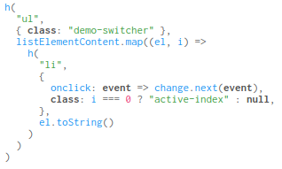

# himple

Lightweight tokenizer and syntax highlighter

#### The following code will generate a rendered code block...

```html
<body>
  <pre><code id="hFuncString"></code></pre>
  <script type="module">
    import createHimple from "./himple.js"
    const himple = createHimple()
    const codeString = `h(
  "ul",
  { class: "demo-switcher" },
  listElementContent.map((el, i) =>
    h(
      "li",
      {
        onclick: event => change.next(event),
        class: i === 0 ? "active-index" : null,
      },
      el.toString()
    )
  )
)
`
    hFuncString.innerHTML = codeString
    himple(hFuncString)
  </script>
</body>
```

#### ... which looks like this



## Credit

Lars Jung and his [lolight project](https://github.com/lrsjng/lolight)
